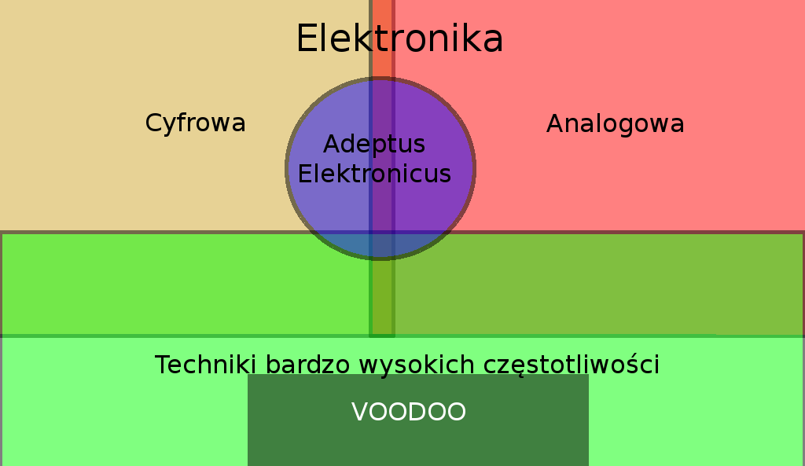

Adeptus Elektronicus
===
## Spotkanie 0.5 - Zakres zagadnień i cele

Mróz Krzysztof
hs3city.slack.com : @mroz
private@mrozo.pl

<!-- footer: "Praise the machine God" - Codex - Cult Mechanicus -->

---

Cele spotkań
===
Spotkania mają na celu stworzenie:
1. silnego, stałego skrzydła technologii nieulotnych w ramach trójmiejskiego hackerspace'a.
2. miejsca spotkań i wymiany doświadczeń dla trójmiejskich elektroników.
3. dostępnego dla członków dobrze wyposażonego laboratorium elektronicznego.

<!-- page_number: true -->
<!-- footer: 4. "To co zwykle Pinky - zdobycie władzy nad światem!" - Mózg -->

---

Cele spotkań cd
===
Spotkania mają na celu stworzenie:
5. pełnego, silnie praktycznego kursu elektroniki od zera do poziomu porównywalnego z poziomem magistra elektroniki
6. zdobycie uznania wśród trójmiejskich firm
7. uznanie przez większość trójmiejskich firm rang wewnętrznych na równi z poziomami wykształcenia od technika do magistra elektroniki włącznie.

<!-- footer: 8. Wyśmiewanie programistów -->

---

Moje prywatne cele
===
Czyli dlaczego to robię?
1. Chęć uporządkowania własnej wiedzy
2. Chęć nauki od innych
3. Poznanie przyszłych współpracowników do założenia firmy i projektów komercyjnych.

<!-- footer: -->

---

Konkrety - filozofia kursu
===

---

Konkrety - zakres kursu
===

TODO powiedzieć dlaczego ? złoty środek

---

Filozofia kursu - wykłady
===

Każdy wykład z pojedyncza będzie:
1. trwać od 10 do 20 minut
2. się skupiać na praktycznym omówieniu jednego problemu
2. zaczynał się od zdefiniowania kompletnego projektu
3. zawierał opis zagadnień związanych z projektem
4. prowadził za rączkę od samego początku aż do praktycznej realizacji projektu

---

Filozofia kursu - wykłady cd.
===

Przykłady tematów wykładów (kolejność przypadkowa):
1. Czy mogę to podłączyć do arduino - prąd, napięcie i moc.
2. Mój pierwszy robot - nota silnikach i ruchu
3. Nie zapomnij o mnie - o komunikacji SPI i kartach SD
4. Szklanka jest do połowy pełna, czy do połowy pusta? - pomiary wielkości nieelektrycznych
5. Ima charging ma lazer! - notka o nie wiem czym

---

Filozofia kursu - narzędzia
===

Kurs nie będzie bazował na konkretnych rozwiązaniach ani narzędziach. W miarę potrzeb będzie wykorzystywał to co jest pod ręką, jednak można się spodziewać, że często będą padać słowa takie jak: arduino, KiCad, LtSpice, Linux, C i kurwa mać.

---

Wstępny harmonogram spotkań
===

* 13 XII 2016 - pierwsze spotkanie wprowadzające wykładowe w ramach dnia otwartego
* 10 I 2017 - drugie spotkanie wykładowe
* 10 II 2017 - trzecie spotkanie wykładowe
* 4 III 2017 - pierwsze spotkanie laboratoryjne
* 14 III 2017 - czwarte spotkanie wykładowe
* 1 IV 2017 - drugie spotkanie laboratoryjne

---

Wstępny harmonogram spotkań cd.
===

Pierwsza faza kursu ma trwać jeden rok. Celem fazy pierwszej jest wstępna integracja elektroników w ramach hackerspace'a oraz dojście z materiałem do poziomu porównywalnego z technikiem elektronikiem. Po tym czasie będzie wciąż dostępny pod postacią materiałów na hackerspace'owym wiki pod ardesem:

http://hs3wiki.pl/index.php?title=Adeptus_Elektronicus

---

Koniec
===
