Adeptus Elektronicus
===
## Spotkanie 2 - Elektroniczny bigos, czyli szybki start

# 

Mróz Krzysztof
hs3city.slack.com : @mroz
private@mrozo.pl
github.com/mrozo

---

Plan spotkania
===
1. Definicja projektu
2. Definicja wymagań funkcjonalnych projektu  
3. Uzasadnienie wyboru projektu
4. Pętla realizacji projektu:
4.1. Wybór wymagania funkcjonalnego.
4.2. Wybór części podstawowych do realizacji wymagania
4.3. Wybór układu realizującego wymagania
5. Analiza wyników

<!-- page_number: true -->

---

Wymagania funkcjonalne projektu
===
1. Bazuje na arduino.
2. Pomiar natężenia światła.
3. Pomiar mocy chałasu.
4. Pomiar temperatury otoczenia.
5. Pomiar wilgotności powietrza.
6. Dioda sygnalizująca pomiar dla każdego z czujników.
7. Buzzer sygnalizujący pomiar.
8. Przycisk wymuszający natychmiastowy pomiar.

---

Wymagania funkcjonalne projektu cd.
===

9. Silna dioda RGB sygnalizująca pomierzone wartości za pomocą jasności: czerwień - jasność, niebieski - temperatura, zielony - wilgotność powietrza. Im wyższa wartość pomiaru - tym większa jasność danego koloru.
10. Przesyłanie wyników pomiarów do komputera.
11. Wyświetlanie wyników pomiarów na komputerze.

---

Uzasadnienie projektu i obranych rozwiązań
===

1. Projekt ma za zadanie być szybką prezentacją typowych rozwiązań projektowych.
2. W projektcie umyślnie wykorzystano mieszaninę czujników analogowych oraz cyfrowych celem prezentacji różnic między nimi.
3. Niektóre elementy są umyślnie przeprojektowane celem ukazania typowych bloków funkcjonalnych.

---

Iteracja 1 - wykorzystanie Arduino
===
Do wykonania projektu zostanie wykorzystana płytka Arduino Nano. Bo tak.

Wynika z tego:
1. Napięcie zasilania całego projektu to 5 V +/- 5%.
2. Wykorzystujemy biblioteki arduino jak leci.

# 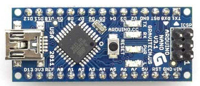

Źródło: https://www.arduino.cc/en/Main/arduinoBoardNano

<!-- footer: @arduino @arduinoNano -->

---

# 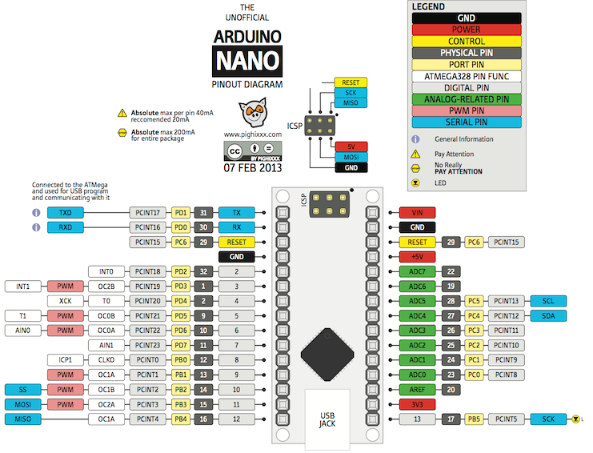
źródło: http://smartduinos.com/wp-content/uploads/2015/09/tumblr_mhwx21ePTX1s5t695o1_12801.png

<!-- footer: @arduino @arduinoNano @pinout-->

---

Notka o programowaniu Arduino
===
1. W kursie wykorzystywane jest arduino IDE w wersji 1.8.0
2. Podczas tworzenia projektów w Arduino bardzo często potrzebne jest zaimportowanie biblioteki. Aby to zrobić należy:
2.1. Jeśli biblioteka jest już w lokalnych zasobach należy wejść w menu `szkic`>`dołącz bibliotekę`>`nazwa biblioteki`
2.2. w przeciwnym wypadku należy najpierw wejść w menu `szkic`>`dołącz bibliotekę`>`zarządzaj bibliotekami`, wyszukać wybraną bibliotekę i ją zainstalować.
3. Każda biblioteka dostarcza również co najmniej jeden przykład. Przygodę z czujnikiem, modułem itd. należy zacząć od odpalenia przykładu. Przykłady znajdują się w menu `plik`>`przykłady`.

<!-- footer: @arduino @biblioteki @ide-->

---

Nota pinach - typy
===

Każdy układ scalony posiada zestaw pinów służących do komunikacji z otoczeniem. Piny te mogą należeć do następujących kategorii: **zasilające**, **sygnałowe**
Dodatkowo piny sygnałowe mogą być **cyfrowe** lub **analogowe**, a na dodatek równolegle są albo **wejściowe** albu **wyjsciowe**. Podział nie wyczerpuje wszystkich możliwości, ale na chwilę obecną jest wystarczający.

Przykłady pinów: zasilający dodatni, zasilający ujemny, wejściowy analogowy, wyjściowy cyfrowy itd.

<!-- footer: @piny @typyPinów -->

---

Nota o pinach - czy mogę to podłączyć
===

1. W układach elektronicznych generalnie piny zasilające powinny być podłączone do zasilania, wyjścia cyfrowe do wejść cyfrowych, zaś wyjścia analogowe do wejść analogowych.
2. Zawsze należy w nocie katalogowej ukladu sprawdzić maksymalne i minimalne napięcia i prądy dopuszczane na danym pinie. Inżynier musi zadbać aby pin zawsze pracował w wyznaczonych przez producenta granicach.

Naturalnie istnieją inżyniersko uzasadnione przypadki innego podłączenia, zaś wymienione w pkt.2 parametry to tylko podstawowe informacje, które potem zostaną rozszeżone

<!-- footer: @piny @parametry -->

---

Iteracja 2 - pomiar natężenia światła 
===
Do pomiaru natężenia światła wykorzystamy fotorezystor. Jest to najprawdopodobniej najprostrzy na to sposób.

# 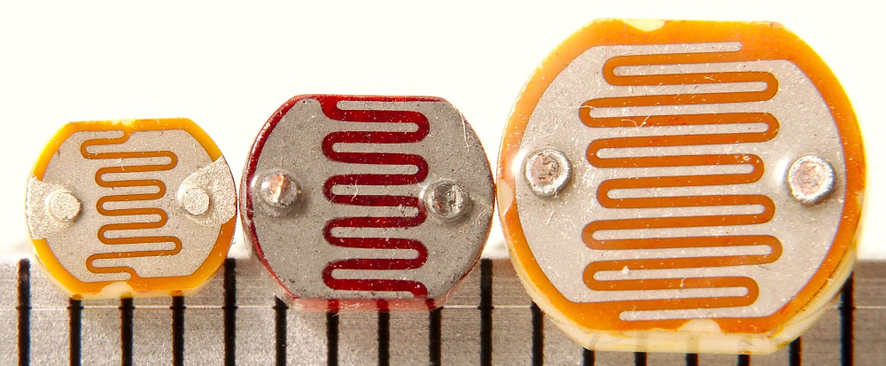

źródło: https://commons.wikimedia.org/wiki/File:Photoresistors_-_three_sizes_-_mm_scale.jpg

<!-- footer: @fotorezystor -->

---
Jak działa fotorezystor
===
Fotorezystor jest typem rezystora, którego rezystancja zmniejsza się w miarę wzrostu natężenia światła. Czyli przetwarza natężenie światła na rezystancję.

Fotorezystor wykorzystany w projekcie pochodził z nieznanego źródła. Jego rezystancja w ciemności wynosiła około 40 kOhm, zaś po wystawieniu na jasne światło spadała ona do około 400 Ohm.

<!-- footer: @fotorezystor @definicja-->

---

Nota o rezystorach
===

Rezystor to element pasywny charakteryzowany przez rezystancję `R`, który wiąże występujące na zaciskach napięcie `U` z prądem `I` w następujący sposób:

$$I = U/R$$

Dowolna postać tego wzoru jest poprawna.

<!-- footer: @rezystor @definicja @równanieRezystora-->

---
Jak używać fotorezystora? Pomiar rezystancji
===
http://lmgtfy.com/?q=arduino+photoresistor

Istnieje wiele różnych na to sposobów, ale najprostrzy wykorzystuje napięciowy dzielnik rezystancyjny. Dzielnik taki powstaje przez szeregowe połączenie dwóch rezystorów (patrz następny slajd), przy czym sygnał wyjściowy pobiera się z pomiędzy rezystorów.

<!-- footer: @fotorezystor @pomiarJasności @pomiarRezystancji-->

---

Nota o układach rezystorów
===

Każdy układ rezystorów może zostać ostatecznie uproszczony do jednego rezystora o rezystancji wyliczonej na podstawie poniższych przekształceń dla (patrząc od góry) połączenia **szeregowego** oraz **równoległego**.

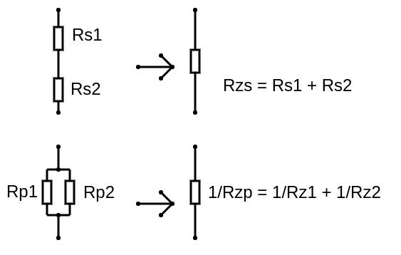

<!-- footer:@rezystor @układZastępczy @połączenieRównoległe @połączenieSzeregowe -->

---

Układ pomiarowy fotorezystora
===
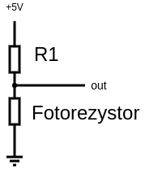

Pomiar jasności odbywa się przez zmierzenie napięcia na linii `out`

Zadanie domowe: wiedząc że `R1=39 kOhm`, zaś fotorezystor `Rf` przybiera wartości od 400 Ohm dla jasnego światła do 40 kOhm w ciemności oraz posługując się informacjami ze slajdów 13, 15 oblicz napięcie wyjściowe `U` w sytuacji gdy fotorezystor jest w ciemności oraz oddzielnie gdy świeci na niego silne światło.

<!-- footer: @fotorezystor @pracaDomowa-->

---

Układ dodatkowy - kondycjonowanie sygnału
===
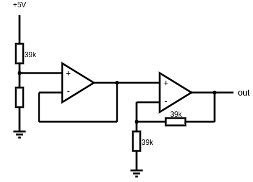

Między fotorezystorem (lewa strona schematu), a arduino (prawa strona schematu "out") zdecydowano się na podłączenie dodatkowo dwóch wzmacniaczy operacyjnych, patrząc od lewej w konfiguracji wtórnika napięciowego oraz wzmacniacza nieodwracającego o wzmocnieniu 2.

<!-- footer: @wtórnikNapięcia @wzmacniaczNieodwracający @wzmacniaczOperacyjny-->

---

Układ dodatkowy - kondycjonowanie sygnału cd.
===

Opisywany układ kondycjonowania sygnału ma dwa zadania:
1. Odizolowanie układu fotorezystora od reszty elementów (wtórnik napięciowy)
2. Wzmocnienie sygnału napięciowego celem łatwiejszego pomiaru (wzmacniacz nieodwracający).

Układ kondycjonowania sygnału nie jest tutaj konieczny - wnosi niewielkie zyski w postaci wzmocnienia sygnału wyjściowego oraz jeszcze mniejsze zyski wynikające z oddzielenia układu pomiarowego od układu fotorezystora. Na dobrą sprawę funkcja 1 jest również realizowana przez wzmacniacz 2, jednak wykorzystano takie rozwiązanie ponieważ wzmcniacze operacyjne z zasady są produkowane w podwójnych obudowach. 

<!-- footer: @wtórnikNapięciowy @wzmacniaczNieodwracający @wzmacniaczOperacyjny-->

---

Zagadka
===
Na slajdzie 17 przy drógim wzmacniaczu można było wykożystać dowolne dwa rezystory o takiej samej wartości. Dlaczego wykorzystano akurat rezystory o wartości 39 kOhm?

<!-- footer: @zagadka-->

---
Iteracja 3 - Pomiar wilgotności i temperatury
===-
Do pomiaru wilgotności powietrza oraz temperatury otoczenia wykorzystany zostanie czujnik DHT11 
Nota katalogowa: http://www.micropik.com/PDF/dht11.pdf

# 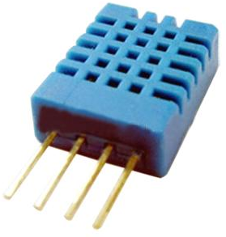

<!-- footer: @pomiarWilgotności @pomiarTemperatury @dht11-->

---
DHT11 - opis
===
DHT11 jest zintegrowanym czujnikiem temperatury oraz wilgotności powietrza z interfejsem cyfrowym.

W nocie katalogowej znajduje się informacja o sposobie podłączenia czujnika. Wykorzystuje on jedną linie cyfrową  do dwustronnej komunikacji cyfrowej. Dwukierunkowość przesyłania danych jest uzyskiwania dzięki rezystorowi podciągającemu do zasilania oraz specjalnemu protokołowi komunikacyjnemu. Po stronie arduino dostępna jest gotowa biblioteka programistyczna umożliwiająca łatwy odczyt danych z podłączonego czujnika.

<!-- footer: @opis @dht11-->

---

DHT11 - sposób podłączenia prosto z noty katalogowej
===
W przypadku tego czujnika jest tylko jeden sposób na podłączenie go.
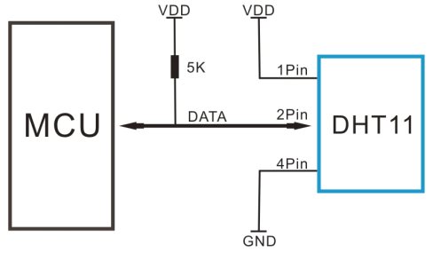
Biblioteki arduino do DHT11 dostarczają przykładowy kod do obsługi czujnika.
<!-- footer: @dht11 @podłączenie-->

---

Iteracja 3 - dioda RGB
===
Wykorzystamy jasną diodę RGB superflux. Cokolwiek to znaczy.

# 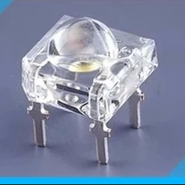

źródło: http://ledsee.com/images/stories/virtuemart/product/10-x-rgb-super-flux-led-com---5mm-lens3.png

<!-- footer: @rgb @led @superflux-->

---

## Parametry 
Napięcie pracy: R: 2,2 V, G: 3,2 V, B: 3,2 V
Maksymalny prąd: 20 mA dla każdego koloru oddzielnie.
Układ: wspólna katoda (plusik!)

## Sterowanie
Dioda obciąża źródło w zbyt wysokim stopniu, aby zasilić ją bezpośrednio z arduino. Należy zastosować układ sterujący, włącznik o większej obciążalności prądowej. Używa się do tego tranzystorów. Ze względu na układ wspólnej katody tranzystor musi odcinać/podłączać masę od/do każdej  z diud składowych. 

<!-- footer: @led @rgb @superflux @parametry @sterowanie -->

---

Sterowanie diodą RGB
===
W roli włącznika odcinającego masę zastosujemy tranzystory NPN w następującym układzie:
# 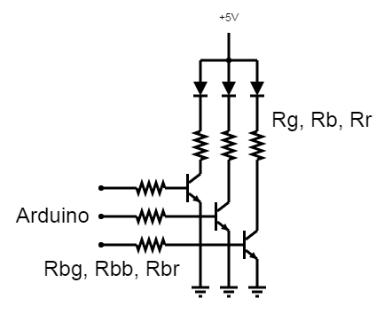

Rezystory Rbg, Rbb, Rbr ograniczają prądy baz rezystorów. 
Rezystory Rg, Rb, Rr ograniczają prądy przepływające przez diody.

<!-- footer: @led  @sterowanie @npn @tranzystor @wspólnyKolektor-->

---

Parametry układu sterowania
===

Wykorzystane tranzystory NPN: BC546B
Maksymalny prąd: 100 mA
Wzmocnienie: >100
Współpracuje z napięciami 5 V.

# Rezystory ograniczające prąd diud
Dla uproszczenia zastosowano tą samą wartość rezystora ograniczającego dla każdego koloru, pomimo różnic napięć pracy. Wybrano wartość 220 Ohm, który ogranicza prąd diud do około 14 mA. W praktyce ten prąd nie zostanie osiągnięty ze względu na rezystory ograniczające prąd bazy.

<!-- footer: @rezystor @rezystorOgraniczający @tranzystor @npn @led @sterowanie-->

---

Parametry układu sterowania
===

## Rezystory ograniczające prąd baz
Rezystory ograniczające prądy baz Rbg, Rbb,Rbr mają za zadanie ograniczyć maksymaplny prąd płynący przez bazę tranzystora, a co za tym idzie również prąd sterowany. Wybrano rezystory o wartośc 43 kOhm, które praktycznie ograniczają prąd pracy diud do około 12 mA.

### Zagadka
Rezystory mogły mieć dowolną, zbliżoną wartość. Dlaczego zastosowano akurat 43 kOhm?

<!-- footer:@rezystor @rezystorOgraniczający @tranzystor @npn @baza @sterowanie @led @zagadka-->

---

Sterowanie jasnością diody 
===
Do sterowania jasnością każdego z kolorów wykorzystano standardową technikę PWM. Jest to sygnał cyfrowy okresowy, który znajduje się w stanie wysokim przez określoną część okresu. 
# 

<!-- footer: @pwm @definicja-->

---

Iteracja 4 - buzzer sygnalizujący pomiar
===
Wykorzystany zostanie KINGSTATE  KXG1205C. 
Nota: http://www.farnell.com/datasheets/1653447.pdf

Pracujący przy zasilaniu 5 V, pobierający około 30 mA wkurwiacz.

## Sposób działania
Buzzer jest prostym, w pełni pasywnym urządzeniem - podłączony do zasilania brzęczy, odłączony - przestaje. Zupełnie jak światło w  pokoju.

<!-- footer: @buzzer @sterowanie-->

---

Sterowanie
===

Jak widać potrzebujemy włącznika, który będzie włączać i wyłączać. Wykorzystamy dokładnie ten sam układ co w przypadku diody LED RGB za wyjątkiem rezystorów ograniczających prąd buzzera, ponieważ ten przystosowany jest do pracy przy 5 V.

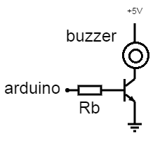
Włączenie buzzera polega poprostu na wystawieniu na podłączony pin arduino stanu wysokiego. Wyłączenie zaś na wystawieniu stanu niskiego. Buzzer jest włączany na okres 1 ms bo innaczej wnerwia.

<!-- footer: @buzzer @sterowanie @npn @tranzystor-->

---

Prezentacja
===

Trochę pytona i działa!

### Ciąg dalszy nastąpi

<!-- footer: -->

---

