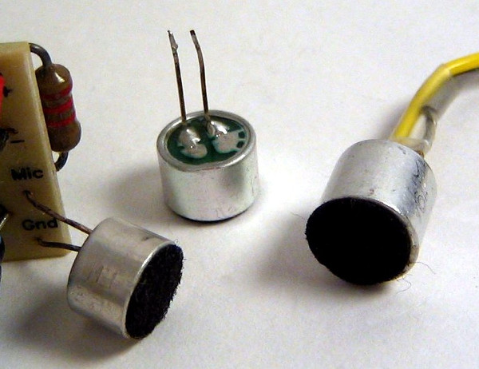
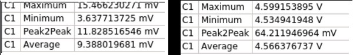
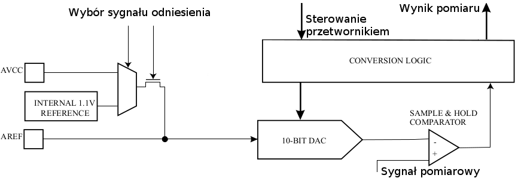
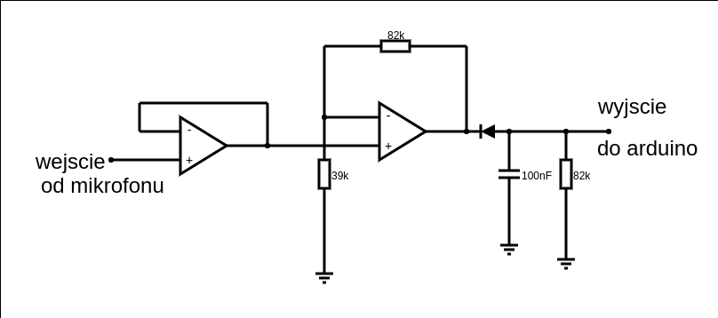
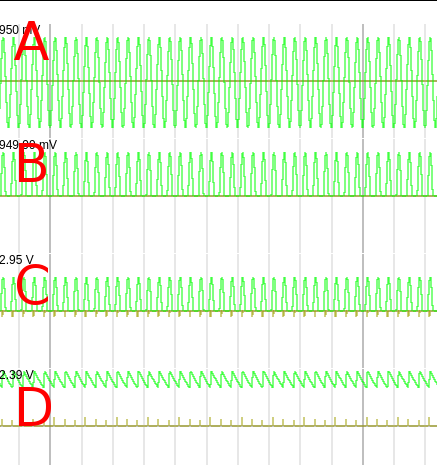
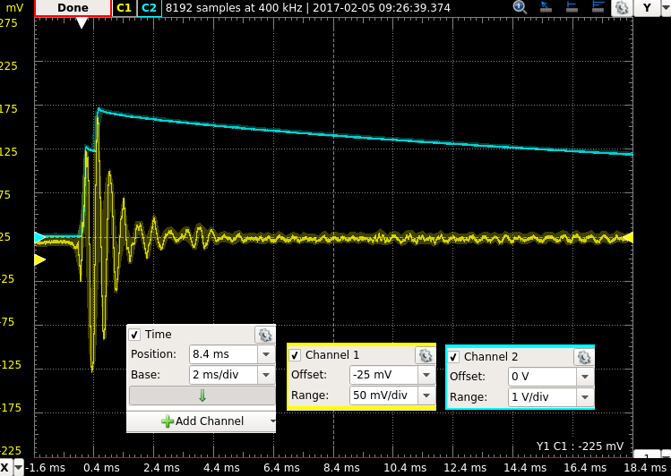
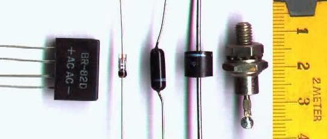
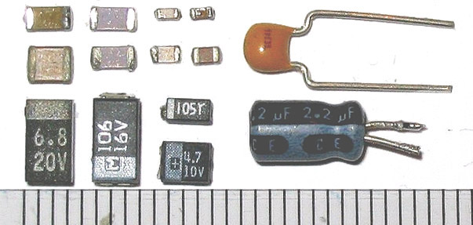

Adeptus Elektronicus
===
## Spotkanie 2 - Elektroniczny bigos, czyli ciąg dalszy nastąpił

 

Mróz Krzysztof
hs3city.slack.com : @mroz
private@mrozo.pl
github.com/mrozo

---

Plan spotkania
===
1. ~~Definicja projektu~~
2. ~~Definicja wymagań funkcjonalnych projektu~~
3. ~~Uzasadnienie wyboru projektu~~
4. Pętla realizacji projektu:
4.1. Wybór wymagania funkcjonalnego.
4.2. Wybór części podstawowych do realizacji wymagania
4.3. Wybór układu realizującego wymagania
5. Analiza wyników

<!-- page_number: true -->

---
Wymagania funkcjonalne projektu
===
1. ~~Bazuje na arduino.~~
2. ~~Pomiar natężenia światła.~~
3. Pomiar mocy chałasu.
4. ~~Pomiar temperatury otoczenia.~~
5. ~~Pomiar wilgotności powietrza.~~
6. Dioda sygnalizująca pomiar dla każdego z czujników.
7. ~~Buzzer sygnalizujący pomiar.~~
8. Przycisk wymuszający natychmiastowy pomiar.

---

Wymagania funkcjonalne projektu cd.
===

9. ~~Silna dioda RGB sygnalizująca pomierzone wartości za pomocą jasności: czerwień - jasność, niebieski - temperatura, zielony - wilgotność powietrza. Im wyższa wartość pomiaru - tym większa jasność danego koloru.~~
10. ~~Przesyłanie wyników pomiarów do komputera.~~
11. ~~Wyświetlanie wyników pomiarów na komputerze.~~

---

Pomiar poziomu hałasu - mikrofon elektrytowy
===

 

---
Mikrofon elektrytowy
===

Jest to bardzo tani i popularny typ mikrofonu stosowany właścniwie wszędzie - w telefonach, komputerach, PDA, RTFM itd.

Na wikipedii napisane jest jak działa, z naszego punktu widzenia ważne są tylko dwie rzeczy:

1. Sposób połączenia mikrofonu do zasilania
2. Czy mikrofon może być podłączony bezpośrednio do arduino? 

<!-- footer: @mikrofon @elektryt -->

---

Sposób podłączenia mikrofonu
===

Wykorzystany mikrofon to KPCM-15E (bo jest tani). 

Nota katalogowa: http://mrozo.pl/hs/pliki/noty_katalogowe/f_04668.pdf

Bezpośrednio z noty odczytujemy sposób podłączenia mikrofonu do zasilania.

<!-- footer: @mikrofon @elektryt @podłączenie @nota -->

---

Czy mikrofon można podłączyć bezpośrednio pod arduino?
===

Nie. Znaczy tak, ale nie ma to sensu. 

Mikrofony elektrytowe charakteryzują się małą amplitudą sygnału wyjściowego - oznacza to, że ciężko jest spróbkować i cokolwiek z nim zrobić.

Co to znaczy "mała amplituda"? Na podstawie pomiarów wyznaczono że wynisi ona maks 65 mV dla bardzo głośnych dźwięków. Wyniki pomiarów (jeden z szeregowo wpiętym kondensatorem wycinającym składową stałą, drugi bez):

 

<!-- footer: @mikrofon @elektryt @sygnal @parametry-->

---

Nota o przetwornikach analogowo cyfrowych (A/D)
===
Dlaczego sygnał wyjściowy z mikrofonu elektrytowego jest "mały"?
W najogólniejszym przypadku przetwarzanie sygnału o ciągłym czasie i ciągłym zbiorze wartości na wartość cyfrową odbywa się przez porównanie sygnału mierzonego z sygnałem wzorcowym.

Schemat ADC z notu katalogowej atmega 328

<!-- footer: @arduino @adc @nota -->

---

Nota o przetwornikach analogowo cyfrowych (A/D) cd.
===
1. Jako że ADC porównuje sygnał mierzony do sygnału wzorcowego nie ma dla niego różnicy czy sygnał mierzony jest większy o 0.001 V czy 1000 V od sygnału wzorcowego. No chyba że coś się zjara.
2. Rozdzielczością przetwornika - precyzja z jaką porównujemy sygnały - czyli najmniejsza wartość zmiany wartości sygnału mierzonego powodująca zmianę sygnału wyjściowego. Rozdzielczość jest zależna od sygnału wzorcowego oraz od szerokości w bitach słowa wyjściowego przetwornika.

<!-- note:
1. Czym jest sygnał wzorcowy?
2. Z kąd pochodzi sygnał wzorcowy? - zintegrowany, zewnętrzny, źródło zasilania
-->

<!-- footer: @adc @omowienie -->

---

Czyli co to znaczy że sygnał jest "mały"?
===

Sygnał jest mały, gdy jego rozpiętość jest porównywalna do rodzielczości przetwornika. W idealnej sytuacji sygnał wejściowy ADC przyjmuje poziomy między 0 V, a napięciem odniesienia (w przypadku arduino 5 V).

Ponieważ długość słowa wyjściowego ADC w arduino wynosi $N=10 bit$, a napięcie odniesienia wynosi $V_{ref}=5 V$ to rozdzielczość wynosi:

$$
V_{LSB} = V_{ref}/2^{N} \approxeq 4.88 mV
$$
Czyli dla pomierzonego zakresu sygnału wyjściowego mikrofonu
można wykryć maks około 10 różnych poziomów. W praktyce mniej
<!-- note:
1. wspomnieć o zakłuceniach
2. aby wykorzystać pełną rozdzielczość pomiaru trzeba by było zaprojektować cały układ oraz oprogramowanie w taki sposób, 
-->

<!-- footer: @adc @rozdzielczosc @ -->

---

Wzmacniacz mikrofonowy - znowu to samo
===

Aby zwiększyć precyzję pomiaru hałasu należy sygnał napierw przeskalować co najmniej o rząd wielkości. Do tego zastosowano ten sam układ co w przypadku czujnika jasności.

Powyższy schemat prezentuje układ wykorzystany do stworzenia detektora poziomu hałasu wraz z zaznaczonymi węzłami.

<!-- note:
1. zobaczcie środek - Między A i C jest ten sam.
2. zmieniono tylko R2 - dzięki temu zwiększono wzmocnienie do 22 razy
-->

<!-- footer: @wzmacniacz @opamp @mikrofon @detektor-wartosci-szczytowej-->

---
Omówienie schematu wzmacniacza mikrofonowego
===

1. kondensator C1 - usuwa składową stałą z sygnału: przed C1 mamy $x+f(t)$, gdzie $x$ to jakaś wartość stała, a $f(x)$ to właściwy sygnał. W punkcie A mamy tylko $f(x)$
2. Między węzłem $A$ i $B$ jest wzmacniacz operacyjny kopiujący sygnał z węzła $A$ do $B$ celem izolowania mikrofonu od reszty układu. Mikrofon jest bardzo czuły na to, co do niego podłączymy (ma niską impedancję wyjściową).

<!-- note:
1. więcej na schemacie na następnej stronie!
-->

<!-- footer:  @detektor-wartosci-szczytowej @omowienie @opamp @skladowa-stala -->

---
Omówienie schematu wzmacniacza mikrofonowego cd.
===

3. Wzmacniacz operacyjny między punktami $A$ i $B$ wraz z rezystorami $R_1$ i $R_2$ wzmacnia kopię sygnału $f'(x)$  $(1+R_2/R_1)\approxeq22$  krotnie

<!-- note:

-->

<!-- footer:  @wzmacniacz @detektor-wartosci-szczytowej @omowienie-->

---

Omówienie schematu wzmacniacza mikrofonowego cd.
===

4. Kondensator $C_2$ gromadzi energię ze wzmocnionego sygnału, zaś $R_3$ _powoli rozładowywuje go.
5. Dioda $D_1$ jest tutaj kluczowa dla tego układu. Uniemożliwia ona rozłwadowywanie $C_2$ przez wzmacniacz operacyjny.

<!-- note:
4. Im mniejszy R3, tym szybciej się rozładowywuje. Trzeba to wyważyć, można w symulatorze
5. wspomnieć o tranzystorze
-->

<!-- footer:   @wzmacniacz @detektor-wartosci-szczytowej @omowienie @dioda-->

---
Wynik symulacji
===

<!-- note:
1. omówić wejście
2. omówić kondensator
3. omówić wzmacniacz powtarzający
4. omówić kondensator i rezystor
5. wspomnieć o diodzie
-->

<!-- footer: @symulacja @wynik @wzmacniacz @detektor-wartosci-szczytowej -->

---

Pomiary układu  $C \to D$
===

<!-- note:
1. to zrobiłem ja! 
2. niebieski to wyjście z układu - D
3. żółty to wyjście wzmacniacza - C
-->

<!--footer: @pomiar @detektor-wartosci-szczytowej -->

---

Pomiary układu  $C \to D$
===

<!-- note:
1. to zrobiłem ja! 
2. niebieski to wyjście z układu - D
3. żółty to wyjście wzmacniacza - C
-->

<!--footer: @pomiar @detektor-wartosci-szczytowej -->

---

Pomiary układu - wzmocnienie $A \to D$
===

<!-- note:
1. sygnał wejściowy - pstryknięcie palcami
2. pstryknąć
3. patrzcie na skalę - różne dla obydwu sygnałów!
4. to jest od wejścia do wyjścia
-->

<!--footer: @pomiar @detektor-wartosci-szczytowej -->

---

Dioda
===

Dioda to element półprzewodnikowy, który pozwala na przepływ prądu tylko w jednym kierunku. Oczywiście o ile nie zostanie przystawione zbyt wysokie napięcie, lub zbyt duży prąd - wtedy się zjara.

Dioda może być potraktowana jako odpowiednik mechanizmu zapadkowego w tylnim kole roweru - jedną stronę przepuszcza energię bez problemu, w drugą zaś - już nie.

<!-- note: 

-->

<!-- footer: @dioda @definicja, źródło zdjęcia: wikipedia.org -->

---

Kondensator
===

Kondensator - działa trochę jak bateria - po podłączeniu do napięcia ładuje się, po podłączeniu do obciążenia - rozładowywuje się. Im wyższe napięcie - tym szybciej się ładuje. Im większa pojemność kondensatora - tym wolniej się napełnia.

Używany jako baterie, części filtrów sygnału, piekielnie ważny, podstawowy element każdego układu elektronicznego.
<!-- note:

-->

<!-- footer: @kondensator @definicja , źródło zdjęcia: wikipedia.org -->

---

===

<!-- note:

-->

<!-- footer:  -->

---

Przyciski
===

<!-- footer:  @przycisk -->

---
Nota o debouncing
===

<!-- footer: @przycisk @debounce -->

---

Wskaźniki LED
===

<!-- footer: @led @wskaznik @rezystor-->

---

LED - tym razem bez tranzystora. Dlaczego?
===

<!-- footer: @led -->

---

Nota o testowaniu
===

<!-- footer:  @testowanie @zlacze-testowe-->

---
Prezentacja
===

# SCHEMAT
<!-- footer: @prezentacja @elektroniczny-bigos -->

---

Interfejs użytkownika, a liczba pinów
===

<!-- footer:  -->

---

Błędny wybór wzmacniacza dla fotorezystora
===

<!-- footer: @blad @fotorezystor @opamp @lm358 -->

---

===

<!-- note:

-->

<!-- footer:  -->

---