Adeptus Elektronicus
===
## Spotkanie 4 - Wielkie otwarcie - zamki elektromagnetyczne

 

Mróz Krzysztof
hs3city.slack.com : @mroz
private@mrozo.pl
github.com/mrozo

---

Plan spotkania
===
0. Wstęp
1. Zdefiniowanie wymagań projektowych
2. Omówienie elementów indykcyjnych
3. Iteracyjne wykonywanie projektu
	3.1. Wybór podzespołów
	3.2. Omówienie podzespołów
	3.3. Realizacja
	3.4. Wnioski
	3.5. Możliwości
4. Omówienie Technologii RFID
5. Wnioski, możliwości

<!-- page_number: true -->

---

Wstęp - starożytne tramwaje
===

[podobno] Pierwsze tramwaje elektryczne miały silniki dostatecznie mocne do jazdy, ale zbyt słabe do jazdy. Problem ten rozwiązano za pomocą kół zamachowych.

Podczas chamowania takie koło było podłączane do napędu tramwaju - powodowało to rozkręcenie kołą (zmagazynowanie w nim energii) oraz chamowanie tramwaju. Przed zatrzymaniem koło było odłączane.

Podczas ruszania, gdy silnik elektryczny był zbyt słaby aby pokonać opory statyczne, wciąż kręcące się koło było z powrotem podłączane do napędu. W ten sposób energia odzyskana z chamowania była zużywana do pokonania maksymalnego tarcia statycznego, czyli poprostu do ruszenia.

---

Wymagania funkcjonalne projektu 1
===
1. Stworzenie prototypu urządzenia zamykającego drzwiczki instrumentów na czas pracy celem uniknięcia wypadków związanych z niepoprawnym urzytkowaniem. Przykład zastosowania: komora klimatyczna, piekarnik, pralka, komora do eksperymentów z niebezpiecznymi substancjami.
1.1. Sterowanie sygnałem 5 V, np. z arduino
---

Wymagania funkcjonalne projektu 2
===


2. Stworzenie prototypu urządzenia kontroli dostępu do szfek, sejfów, szuflad itp. 
2.1. Urządzenie powinno się automatycznie zatrzaskiwać w momencie zamknięcia.
2.2. Urządzenie powinno zostać zamknięte nawet po utracie zasilania.
3.3. Otwierania drzwi tylko z wykorzystaniem identyfikatora RFID

---

~~Wymagania funkcjonalne projektu 3~~
===
~~3. Stworzenie prototypu systemu kontroli dostępu do pomieszczenia w oparciu o zamek elektromagnetyczny, który:~~
~~3.1. Domyślnie jest zatrzaśnięty.~~
~~3.2. Samoczynnie ulega zatrzaśnięciu w momencie zamknięcia drzwi.~~
~~3.3. Istnieje możliwość zdalnego otwarcia.~~
~~3.4. Ze względów bezpieczeństwa w razie utraty zasilania ulega automatycznemu otwarciu.~~
~~3.5 Sterowanie sygnałem 5 V, np. z arduino~~

**Projekt został zrealizowany i zaprezentowany, a źródła znajdują się w odpowiednim folderze, jednak nie został opisany w prezentacji.**

---

~~Wymagania funkcjonalne projektu 4~~
===

~~4. Stworzenie prototypu urządzenia kontroli dostępu do pomieszczenia, z możliwością:~~
~~4.1. współpracy z klasycznymi, istniejącymi już drzwiami wejściowymi, posiadającymi od wewnątrz klamkę, zaś od zewnątrz tylko dziurkę od klucza, czyli możliwość otwierania drzwi przez naciśnięcie kalmki oraz/lub za pomocą klucza od zewnątrz oraz/lub zdalnie.~~
~~4.2. Sterowanie sygnałem 5 V, np. z arduino~~
~~4.3. Otwierania drzwi z wykorzystaniem identyfikatora RFID~~
~~4.4. Dodawanie oraz uswanie autoryzowanych identyfikatorów RFID~~
~~4.5. Otwarcia drzwi z wykorzystaniem przycisku~~

**Projekt został zrealizowany i zaprezentowany, a źródła znajdują się w odpowiednim folderze, jednak nie został opisany w prezentacji.**


---

Wymagania funkcjonalne projektu 5
===

5. Stworzyć układ zamka elektromagnetycznego i kontrolera możliwego do otwarcia z wykorzystaniem:
5.1 zdalnej aplikacji komputerowej
5.2 przycisku wewnątrz budowli
5.3 Autoryzowanej karty RFID
5.4 Pełna kontrola nad otwieraniem drzwi znajduje się po stronie aplikacji komputerowej.
5.5 Zasilany jest z wykorzystaniem 12 VDC


---


Indukcja elektromagnetyczna
===
Aby unikać nieeleganckich powtórzeń termin "indukcja elektromagnetyczna: od czasu do czasu zostanie zastąpiony terminem "magia".

W najprostrzych słowach to zjawisko/cecha naszego wszechświata będąca relacją między przepływem prądu, a zmianą strumienia pola magnetycznego.

Opis ilościowy: 
1. Prąd płynący "w kółko" generuje pole magnetyczne proporcjonalne do prądu.

2. Zmiana strumienia pola magnetycznego przepływającego przez pętlę przewodnika generuję w nim prąd proporcjonalny do zmiany wartości strumienia.

---

Strumień pola magnetycznego generuje prąd? A po ludzku?
===
1. Weź kawałek druta, magnes oraz diodę LED.
2. Zrób z druta sprężynkę na dyle dużą, aby móc przez nią swobodnie przepuścić magnes. Im więcej zwojów, tym lepiej.
3. Do końców sprężynki podłącz LED.
4. Poprzepuszczaj magnes przez środek sprężynki z różnymi prędkościami i w obydwu kierunkach.
5. Jakie są wnioski?
5.1. Co powoduje przepuszczanie magnesu przez sprężynkę?
5.2. Co powoduje zmiana prędkości przepuszczania magnesu?
5.3. Kiedy LED się świeci, a kiedy nie?
6. Zbuduj elektrownię.
7. Profit

---

Prąd generuje pole magnetyczne? A po ludzku?
===
1. Weź sprężynkę z poprzedniego eksperymentu, odłącz leda.
2. Weź dwie takie same śruby (nie każdy metal zadziała). O rozmiarach zbliżonych do magnesu.
3. Nałóż sprężynę na jedną ze śrób - nie zrób zwarcia!
4. Podłącz sprężynkę do baterii.
5. Sprubuj najpierw dotknąć drugiej śruby śrubą w sprężynce, a potem rozłączyć te śruby.
6. Powtórz eksperyment z bateriami o różnych napięciach oraz śrubami z różnych metali.
7. Jakie są wnioski?

---

Czekaj czekaj!
===

Jeśli: 
1. zmiana prądu generuje zmianę strumienia pola magnetycznego
2. zmiana strumienia pola magnetycznego generuje prąd

To oznacza że zmiana prądu przepływającego przez sprężynkę (dalej zwaną cewką) powoduje zmianę strumienia pola magnetycznego, która to z kolei generuje prąd przeciwstawiający się zmianie. Tym większy, im większa jest zmiana.

Energia potrzebna do przeciwstawiania się zmianom jest przekazywana lub pobierana z pola magnetycznego cewki. Oznacza to, że idealna cewka jest bezstratną "baterią".

<!-- footer: akcja i rekacja nigdy nie dadzą Ci spokoju; @cewka @omówienie -->

---

Urządzenia elektromechaniczne, a indukcja elektromagnetyczna
===

Omówione wyżej zjawiska są wykożystywane do przetwarzania energii elektrycznej na energię kinetyczną, czyli mówiąc prościej "magia sprawia że prund porusza przedmiotami". 

Możliwe jest również wykożystanie tego zjawiska w drugą stronę - zarówno do generacji prądu, np. dynamo, przetwarzania parametrów energii elektrycznej, np. transformator, jak i do tworzenia czujników np. przepływu prądu, czy przesunięcia. Zagadnienia te nie wchodzą w obszar zainteresowań dzisiejszego spotkania.

<!-- footer: -->

---

Problem stanów przejściowych
===

Urządzenia wykorzystane do realizacji tego projektu to różne wariacje na temat elektromagnesu, który może znajdować się w trzech stanach: wyłączonym, włączonym oraz przejściowym. O ile dwa pierwsze stany nie stanowią problemu - cewka elektromagnesu działa wtedy jak zwykły przewodnik, o tyle stan przejściowy musi zostać dokładnie przeanalizowany.

### Stan przejściowy
To nic innego, jak moment przełączania stanu urządzenia. W tym momencie teoretycznie następuje natychmiastowa zmiana wartości prądu z X do zera, albo na odwrót. Czy widać już problem?

---

Odpowiedź cewki na skokową zmianę przyłożonego napięcia
===
Skoro:
1. Im większa/szybsza zmiana prądu przepływającego przez cewkę, tym większa zmiana strumienia magnetycznego,
2. Im większa/szybsz zmiana strumienia magnetycznego, tym większy prąd indukowany w cewce.

to co się stanie jeśli nagle odłączymy prąd  od cewki, powodując tym samym nieskończenie szybką zmianę prądu przepływającego przez tą cewkę?

**Ja się pytam: co się wtedy stanie???**

---

Otóż to! - Włączenie elektromagnesu
===


<!-- footer: @elektromagnes @obserwacja @oscyloskop @indukcyjnosc-->

---

Otóż to! - Wyłączenie elektromagnesu
===

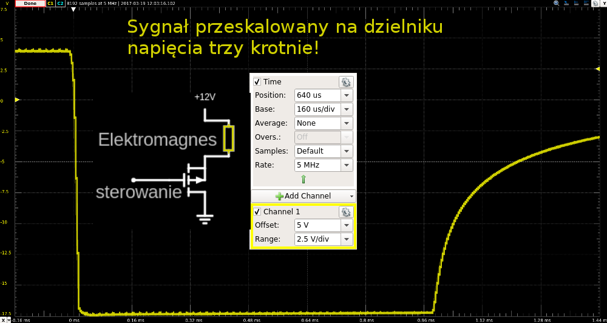

<!-- footer: @elektromagnes @obserwacja @oscyloskop @indukcyjnosc -->

---

Analogia do starożytnych tramwajów
===

* Co się stanie, jeśli podłączymy cewkę do zasilania? - **Prąd** zacznie powoli **wzrastać**. Tym wolniej, im większa jest pojemność cewki.
* Co się stanie, jeśli podłączymy koło zamachowe do napędy? - **Prędkość kątowa** koła zacznie powoli **wzrastać**. Tym wolniej im większa jest masa koła.

Opisy nie są zdefiniowane z precyzją naukową. Mają tylko dostarczyć skojarzeń ułatwiających zrozumienie zagadnienia.

<!-- footer: @indukcyjnosc @opis @analogia -->

---

Analogia do starożytnych tramwajów
===


* Co się stanie jeśli nagle prąd przestanie płynąć przez cewkę? - **Napięcie na cewce** gwałtownie wzrośnie, tak aby w miarę  możliwości **utrzymać stałą wartość prądu** przepływającego przez cewkę. Im większa indukcyjność cewki, tym dłużej wspomniane napięcie będzie się utrzymywać.
* Co się stanie jeśli nagle wychamujemy koło zamachowe? - **Siła, z którą koło napiera na wał** gwałtownie wzrośnie, tak aby w miarę możliwości uniemożliwić zmianę szybkości kątowej koła. Siła będzie działać tym dłużej i będzie większa, im cięższe jest koło.

Opisy nie są zdefiniowane z precyzją naukową. Mają tylko dostarczyć skojarzeń ułatwiających zrozumienie zagadnienia.

<!-- footer: @indukcyjnosc @opis @analogia -->

---

Walka ze szpilkami napięciowymi
===
Sposoby na poradzenie sobie ze szpilkami generowanymi przez elementy inducyjne:
1. Stosowanie elementów z zapasem parametrów (maksymalnego napięcia).
2. Stosowanie szybkich diud półprzewodnikowych spolaryzowanych zaporowo odprowadzających szpilki do linii zasilania.
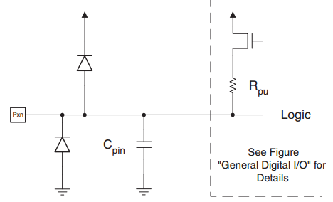


<!-- footer: @dioda @szpilki -->

---

Walka ze szpilkami napięciowymi
===
3. Stosowanie diud spolaryzowanych zaporowo, podłączonych równolegle do elementu indukcyjnego, tak, aby szpilka "odwrotnego napięcia" przeszła przez diodę, zamiast przez układ.
4. Albo skożystać z gotowych układów zabezpieczających...


<!-- footer: @dioda @szpilki -->

---

Wstęp do części projektowej
===

1. Wszystkie projekty wykorzystują proste programy napisane na platformę arduino pro mini $16 MHz, 5 V$.
2. Projekty wykorzystują dwie linie zasilające: $+5 V$ oraz $+12 V$. Obie generowane są przez moduły konwerterów buck z jednego, zewnętrznego źródła zasilania. W dalszych częściach prezentacji temat lini zasilania jest pomijany.

<!-- footer: -->

---

Pliki źródłowe
===

1. w katalogu `sources` znajdują się źródła programów na plaformę arduino.
2. w katalogu `circuits` znajdują się źródła schematów wykorzystywanych w prezentacji, stwożonych za pomocą programu circuitjs, dostępnego pod adresem: http://www.falstad.com/circuit/circuitjs.html
3.W katalogu `datasheets` znajdują się noty katalogowe wykorzystanych układów.

---

Projekt 1: zamek do drzwiczek instrumentów/urządzeń
===

1. Stworzenie prototypu urządzenia zamykającego drzwiczki instrumentów na czas pracy celem uniknięcia wypadków związanych z niepoprawnym urzytkowaniem. Przykład zastosowania: komora klimatyczna, piekarnik, pralka, komora do eksperymentów z niebezpiecznymi substancjami.
1.1 Sterowanie sygnałem 5 V, np. z arduino

**Analiza wymagań:**
1. jako że cały układ ma być zintegrowany w ramach jednego urządzenia, nie trzeba stosować zabezpieczeń przed przepięciami/zwarciami wyjścia.
2. Cały układ może być maksymalnie prosty.


<!-- footer: -->

---
Wybrane rozwiązanie - zamek magnetyczny
===

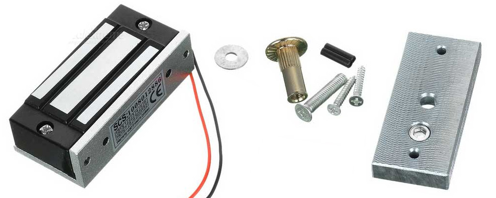
Parametry:
1. Napięcie zasilania: 12 V
2. Pobór prądu: ~130 mA

Części składowe: elektromagnes, płytka na drzwi, śróby montażowe

<!-- footer: -->

---

Wybrane rozwiązanie - analiza
===

1. Jako, że całość ma być zamknięta w jednym urządzeniu, można zastosować najprostrze możliwe rozwiązanie - tj. sterowanie elektromagnesem z wykorzystaniem jednego tranzystora.
2. Ponieważ prąd i napięcie są stosunkowo douże, zaś układ ma pracować w trybie ciągłym, zostanie zastosowany tranzystor typu MOS.
3. Ponieważ sygnał sterujący ma poziom 5 V i małą wydajność prądową, należy dodać układ umożliwiający wysterowanie tranzystora kluczującego na wyjściu.


<!-- footer: -->

---
Mosfet sterujący elektromagnesem
===

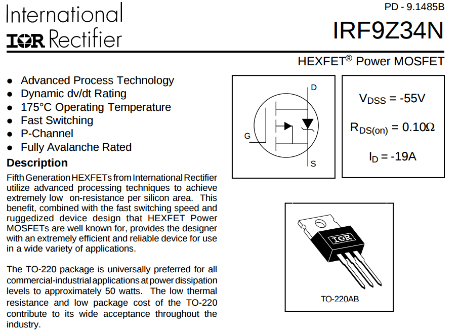

<!-- footer: @irf9z34n @mos @nota_katalogowa-->

---

Dlaczego irf9z34n?
===

Tranzystor ten jest o wiele, wiele za mocny do tego zastosowania. Z powodzeniem mógłby sterować urządzeniami o mocy wyjściowej rzędu kilkudziesięciu wató - np. grzałkami, silnikami dużych mocy, oświetleniem itp. 
W tym projekcie został zastosowany ponieważ:
1. Ma duży zapas każdego możliwego parametru umożliwiający wykorzystanie go bez dodatkowych zabezpieczeń.
2. W tym przypadku można go wykorzystać bez żadnych dodatkowych układów chłodzących ( wprzypadku niektórych tranzystorów bipolarnych byłby konieczny).
3. Akurat miałem ich kilkadziesiąt w szafce.

<!-- footer: @irf9z34n @uzasadnienie -->

---

Jak działa mosfet? - sterowanie 
===

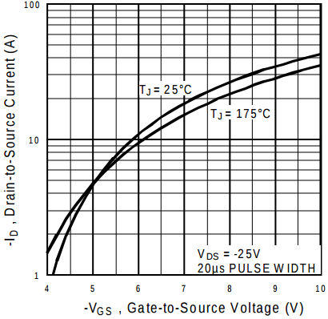

Wykres przedstawia maksymalny prąd przepuszczany przez tranzystor w funkcji napięcia sterująceg $V_{GS}$.

**Zauważ że tranzystor MOS jest sterowany napięciem**

<!-- footer: @mos @sterowanie @charakterystyka-->

---

Jak działa mosfet? - sterowanie cd.
===


Jako że chcemy wykorzystać tranzystor w roli przełącznika, interesują nas tylko skrajne punkty pracy dla $V_{GS} \approx 0$ oraz $V_{GS} \approx V_{cc}$ dla których prąd maksymalny wynosi odpowiednio $0 A$ oraz $\approx 12 A$ 


<!-- footer: @mos @sterowanie @charakterystyka-->

---

Sterowanie mosfetem - tranzystorocepcja
===

Według założeń projektowych, sygnał sterujący ma amplitudę $5 V$,
zaś na poprzedniu slajdzie ustaliliśmy, że do sterowania mosfetem potrzebujemy sygnału o amplitudzie $12 V$. Jak to obejść?

Gdybyśmy tylko posiadali jakiś przełącznik zdolny do takich rzeczy...
<!-- footer: -->

---

Tranzystor bipolarny sterujący mosfetem
===

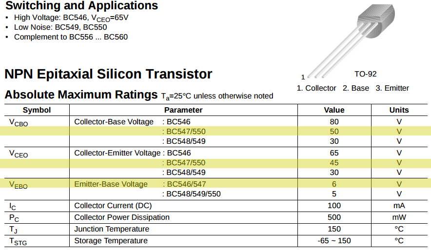

Dlaczego BC547? Bo to klasyk do takich zastosowań.

<!-- footer: -->

---

Tranzystor bipolatny w roli sterownika mosfeta
===

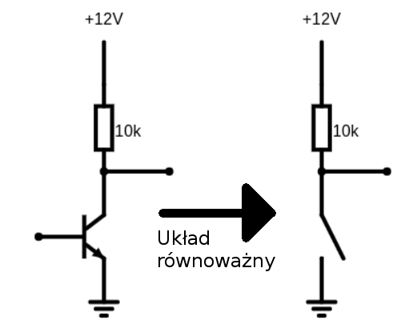

Działanie: gdy tranzystor jest włączony, wyjście jest zwarte do masy, zaś gdy wyłączony wyjście jest zwarte przez rezystor do zasilania. Taki rezystor nazywamy rezystorem podciągającym.

<!-- footer: @tranzystor @przełącznik @bipolarny @pullup @podciągający-->

---
Jak to działa? Poziomy logiczne na kolejnych węzłach układu
===

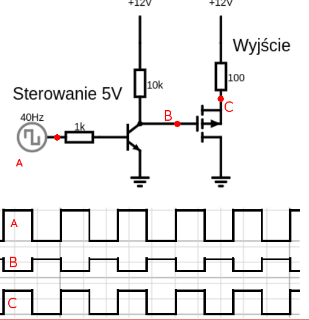


<!-- footer: -->

---

Po co rezystor podciągający do zasilania przy tranzystorze MOS?
===


Jak zauważyliśmy na stronie 21, tranzystory MOS są sterowane napięciem. Jest tak ponieważ wejście sterujące mos (bramka) nie jest zwarte z wyjściem - **prąd nie płynie przez bramkę**. Oznacza to, że nóżka tranzystora podłączona do bramki, **jeśli nie zostanie do czegoś podłączona**, "wisi w powietrzu", a każdy wiszący w powietrzu kawałek metalu działa jak antena - zbiera śmieci z eteru. Te śmieci indukują ciągle zmieniające się, losowe zmianypotencjału przewodnika.

**Wniosek:** nigdy nie zostawiaj w układzie nie podłączonych do niczego nóżek. Nawet jeśli ich nie używasz zewrzyj je do masy, ewentualnie zasilania. W mikrokontrolerach wymuś zerowy potencjał na nieużywanych pinach `digitalWrite(PIN, LOW)` !


<!-- footer: @mos @pullup @nieuzywane_piny-->

---

Prezentacja
===
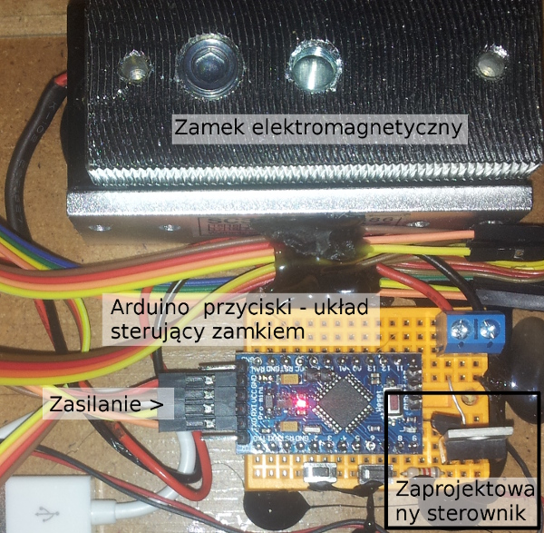

<!-- footer: @prezentacja @zdjecie @zamek_elektromagnetyczny -->

---

Sposób użycia układu
===
Z zaprezentowanego na stronie 26 wykresu można łatwo wywnioskować, że stan wysoki na wejściu powoduje włączenie elektromagnesu (zatrzaśnięcie zamka).

W pliku `sources/1_simple_electromagnet` znajduje się implementacja prostego programu używanego do sterowania zamkiem za pomocą dwóch przycisków - jednego do zamykania, a drugiego do otwierania.

**Notka:** Ze względu na ograniczoną ilość miejsca na płytce stykowej zastosowano brudny trik. Więcej w komentarzach zawartych w kodzie.

<!-- footer: -->

---

Projekt 2 - zamek do szafki/szuflady
===

2. Stworzenie prototypu urządzenia kontroli dostępu do szfek, sejfów, szuflad itp. 
2.1. Urządzenie powinno się automatycznie zatrzaskiwać w momencie zamknięcia.
2.2. Urządzenie powinno zostać zamknięte nawet po utracie zasilania.
3.3. Otwierania drzwi tylko z wykorzystaniem identyfikatora RFID

<!-- footer: -->

---

Projekt 2 - wykorzystany zamek
===
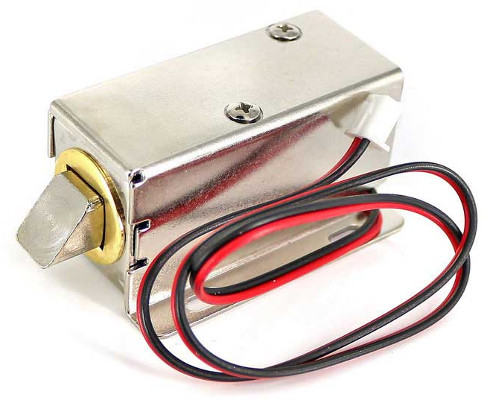

Właściwości: normalnie zamknięty, po przyłożeniu napięcia otwiera się, napięcie pracy $12 V$, pobór prądu $\approx15 0mA$, otwory montażowe, może pracować w dowolnej orientacji.


<!-- footer: @analiza @zamek elektromagnetyczny @właściwości-->

---

Sterowanie
===

Sytuacja jest bardzo podobna do projektu 1, dlatego też wykżystamy dokładnie ten sam sterownik - tranzystor bipolarny sterujący mosfetem.


<!-- footer: -->

---

Wykorzystane rozwiązania
===

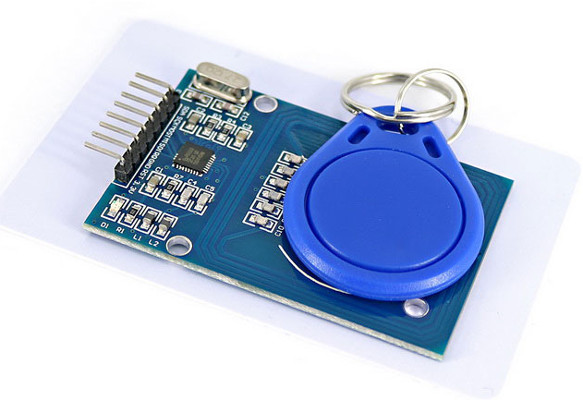


Czytnik rfid **RC522** - Cechy: Komunikacja SPI, napięcie pracy 3.3V, piny tolerujące sygnały cyfrowe $5 V$.

<!-- footer: -->


---
RFID - obsługa
===
1. zasilanie - układ wymaga zasilania $3.3 V$, w związku z czym zastosowano klasyczny układ LD1117V33 - stabilizator liniowy $3.3 V$ z dwoma kondensatorami - $100uF$ oraz $10uF$. 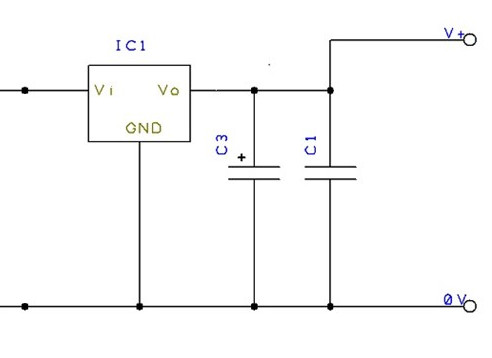

Zastosowano tani czytnik z Chin, a do jego uruchomienia wykorzystano toturial:  
http://playground.arduino.cc/Learning/MFRC522


<!-- footer: -->

---

Prezentacja projektu
===


---

Komentarz do projektu
===

Identyfikator autoryzowanej karty jest zakodowany z sztywno w programie. W momencie wykrycia autoryzowanej karty zamek otwiera się na 3 sekundy - akurat żeby otwożyć szufladę.

Projekt jest prostym rozwinięciem poprzedniego. Należy go traktować jako kolejną iterację, która może się przydać w określonych warunkach wyszczególnionych w założeniach projektowych - w szfkach i szyfladach. Sam czytnik może być ukryty za plastikową obudową lub nawet deską.

Ze wzgldu na to, że projekt ma być zamknięty i niedostępny dla człowieka, bez możliwości dotknięcia - brak interfejsu użytkownika w postaci przycisków itp. - można darować wszelkie dyskusje na temat bezpieczeństwa, przebić i izolacji galwaniacznej.

<!-- footer: -->

---


Projekt 5 - analiza wymagań 
===

5. Stworzyć układ zamka elektromagnetycznego

## Wybrane rozwiązanie
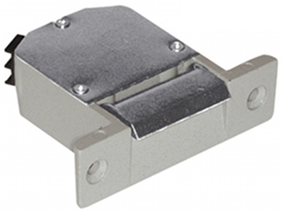
Koszt: 30zł, zasilanie:12 V, współpracuje z klasycznymi wkładkami w typowych drzwiach 


---


Projekt 5 - analiza wymagań 
===


5. Stworzyć układ zamka elektromagnetycznego i **kontrolera** możliwego do otwarcia z wykorzystaniem:
5.1 zdalnej aplikacji komputerowej


## Wybrane rozwiązanie
Projekt zostanie zrealizowany z wykorzystaniem esp8266 - modułu elektrkonicznego firmy Expresiff Systems zasilanego z szyny 3.3VDC zawierającego mikrokontroler, pamięć flash, układ do komunikacji WIFI, GPIO i wiele innych.

esp8266 jest wspierane przez środowisko programistyczne PlatformIO, które zostanie wykorzystane do realizacji projektu.

---

Projekt 5 - analiza wymagań 
===


5. Stworzyć układ zamka elektromagnetycznego i kontrolera możliwego do otwarcia z wykorzystaniem:
5.1 zdalnej aplikacji komputerowej
## Wybrane rozwiązanie

Do zdalnej kontroli zostanie wykorzystana technologia WebSocket - jest to rozszeżenie standardu HTTP umożliwiające asynchroniczną, dwukierunkową komunikację między dwoma aplikacjami.
Komunikacja odbywa się z wykorzystaniem wiadomości (a nie strumieni).

---

Projekt 5 - analiza wymagań 
===


5. Stworzyć układ zamka elektromagnetycznego i kontrolera możliwego do otwarcia z wykorzystaniem:
5.2 przycisku wewnątrz budowli

## Wybrane rozwiązanie
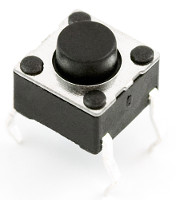
Wciśnięcie przycisku spowoduje wysłanie informacji do programu sterującego, który podejmuje decyzję o otwarciu drzwi.

---

Projekt 5 - analiza wymagań 
===

5. Stworzyć układ zamka elektromagnetycznego i kontrolera możliwego do otwarcia z wykorzystaniem:
5.3 Autoryzowanej karty RFID
## Wybrane rozwiązanie


---


Projekt 5 - analiza wymagań 
===

5. Stworzyć układ zamka elektromagnetycznego i kontrolera możliwego do otwarcia z wykorzystaniem:
5.4 Pełna kontrola nad otwieraniem drzwi znajduje się po stronie aplikacji komputerowej.
## Wybrane rozwiązanie
Aplikacja zostanie napisana w pythonie, powstanie w formie aplikacji terminalowej POC. 

---


Projekt 5 - analiza wymagań 
===

5. Stworzyć układ zamka elektromagnetycznego i kontrolera możliwego do otwarcia z wykorzystaniem:
5.5 Zasilany jest z wykorzystaniem 12 VDC
## Wybrane rozwiązanie
Gotowy moduł konwertera DC-DC typu BUCK (w dół) do zasilania elektroniki oraz przekaźnik do sterowania zamkiem. 

---

Wykorzystane narzędzia - PlatformIO
===

Narzędzie - kombajn wspierający wiele różnych platform/mikrokontrolerów/płytek prototypowych służące do zarządzania bibliotekami, kompilacji  oraz wgrywania programów do pamięci urządzenia. Posiada wiele dodatkowych funkcjonajlności, jak np. monitor portu szeregowego. A co najważniejsze wspiera mi. biblioteki i platformy arduino.

Narzędzie składa się z dwóch części:
1. Środowiska programistycznego opartego na edytorze Atom
2. Narzędzia terminalowego `pio` odpowiedzialnego za obsługę wszystkich funkcji - tj. zarządzania projektem, bibliotekami, kompilację, wgrywaniem programu do urządzenia itd.

**Według strony internetowej platformIO możliwe jest zintegrowanie tego narzędzia z praktycznie dowolnym środowiskiem, w tym z eclipse.**


---

Wykorzystane narzędzia - PlatformIO
===


---

Wykorzystane narzędzia - PlatformIO
===

Przykładowe możliwości:
* `pio lib search websocket` - wyszukaj bibliotek zawierających w opisie słowo "websocket"
* `pio lib install WebSocketClient` - zainstaluj bibliotekę
* `pio device list` - pokaż wspierane urządzenia podłączone do PC
* `pio device monitor -p /dev/ttyUSB0 --baud 115200` - otwórz monitor portu szeregowego. Domyślne środowisko robi to za ciebie podaczas odpalania monitora portu z paska narzędziowego. 

---

PlatformIO - podstawowe komendy
===

```js
Usage: pio [OPTIONS] COMMAND [ARGS]...

Commands:
  account   Manage PIO Account
  boards    Embedded Board Explorer
  ci        Continuous Integration
  debug     PIO Unified Debugger
  device    Monitor device or list existing
  init      Initialize PlatformIO project or update existing
  lib       Library Manager
  platform  Platform Manager
  remote    PIO Remote
  run       Process project environments
  settings  Manage PlatformIO settings
  test      Local Unit Testing
  update    Update installed platforms, packages and libraries
  upgrade   Upgrade PlatformIO to the latest version
```

---

Realizacja projektu - minimalne podłączenie ESP
===


Linia zasilająca 3.3V powstanie po przepuszczeniu 12 V przez konwertertypu DC-DC buck.

<!-- footer: źródło: http://hackaday.com/2015/03/18/how-to-directly-program-an-inexpensive-esp8266-wifi-module/ -->

---

Programowanie ESP w stanie "surowym"
===

Aby wprowadzić moduł w tryb bootloadera należy zewrzeć do masy piny  RST oraz GPIO0, a następnie zwolnić najpierw RST, potem GPIO0.

Spowoduje to uruchomienie konsoli na porcie UART, która umożliwia wgranie nowego programu do pamięci modułu.

UART w module ESP autmagicznie wykrywa przepustowość połączenia. W jaki sposób - nie pytajcie.

Aby wgrać nowy program do ESP należy podłączyć adapter USB-UART do komputera oraz ESP, a następnie w środowisku PlatformIO wcisnąć "Upload" (Duża strzałka w prawo na pionowej belce narzędziowej).

<!-- footer: -->

---

Sposób podłączenia czytnika do ESP
===
Tutorial i źródło: http://www.instructables.com/id/WiFi-RFID-Reader/


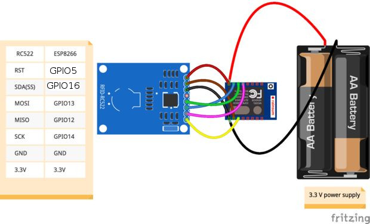

---

WebsocketsClient - Biblioteka arduino dla ESP
===
Instalacja w PlatformIO:`pio lib install WebScockets`
Aby zestawić połączenie z wykorzstaniem tej biblioteki należy:
1. Uruchomić docelowy serwer WebSocket
2. zestawić połączenie WiFi
3. zestawić połaczenie WebSocket na danym IP oraz porcie.
4. Dodać kod `webSocket.loop();` do głównej pętli programu.
5. Stworzyć implementację funkcji `webSocketEvent`.


Przykład zastosowania:
https://github.com/Links2004/arduinoWebSockets/blob/master/examples/WebSocketClient/WebSocketClient.ino

---

Aplikacja zardządzająca
===
Aplikacja wykorzystuje bibliotekę Simple Websocket Server.
Instalacja `$ sudo pip install git+https://github.com/dpallot/simple-websocket-server.git`

Najprostrzy serwer: `$ python /usr/local/lib/python2.7/dist-packages/SimpleWebSocketServer/SimpleExampleServer.py --example echo` 

Przykład minimalnej aplikacji: https://github.com/dpallot/simple-websocket-server/blob/master/README.md

---

Aplikacja zarządzająca - logika
===

Punktem wejściowym aplikacji jest funkcja `start` Wczytuje ona ustawiena oraz uruchamia następujące wątki:
1. `SimpleWebSocketServer.serveforever` - nieskończona pętla serwera WebSocket.
2. `settings_saver` - wątek regularnie zapisujący w tle aktualne ustawienia.
3. `cli` - wątek interpretujący polecenia od użytkownika.

---

Aplikacja zarządzająca - intepreter poleceń
===

Intepreter poleceń użytkownika oraz parser wiadomości kontrolera wykorzystują tę samą zasadę działania polegającą na:
1. Pobraniu wiadomości/polecenia
2. Przyrównania początku polecenia do zestaw znanych poleceń.
3. W przypadku uzyskania zgodności zostaje wywołana funkcja przypisana do polecenia, a niedopasowana końcówka polecenia zostaje przekazana jako argument.


---

http://bbs.espressif.com/download/file.php?id=893&sid=5257cfcc720b03f6b2df91557a543d41&mode=view

---

Ciekawe linki
===

1. Wspaniały stefan i podstawy cewek część 1 i 2: https://youtu.be/kdrP9WbJIb8 , https://youtu.be/XCnI6ZOYKes
2. Toturial o arduino i RFID: http://playground.arduino.cc/Learning/MFRC522
3. Symulator prostych układów elektronicznych: http://www.falstad.com/circuit/circuitjs.html

<!-- footer: -->

---
